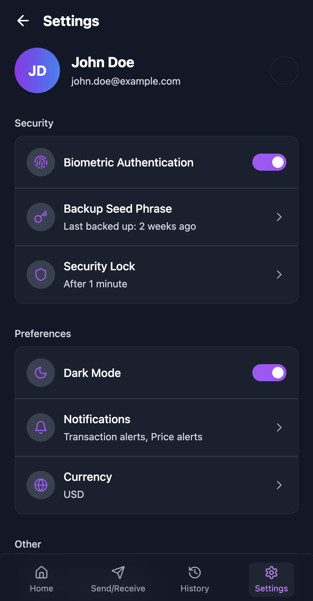
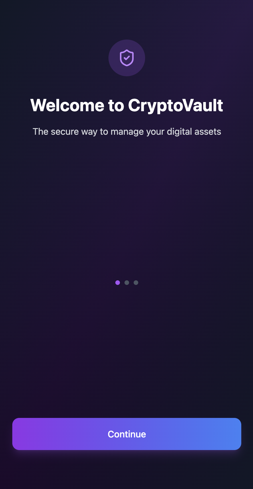
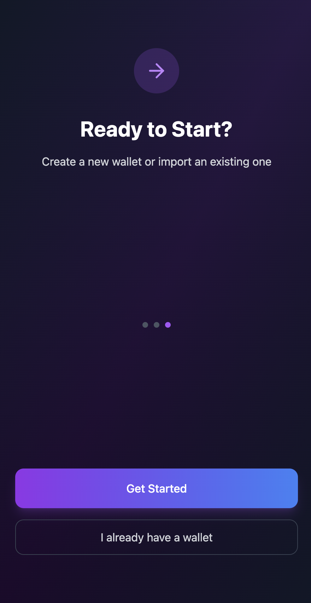
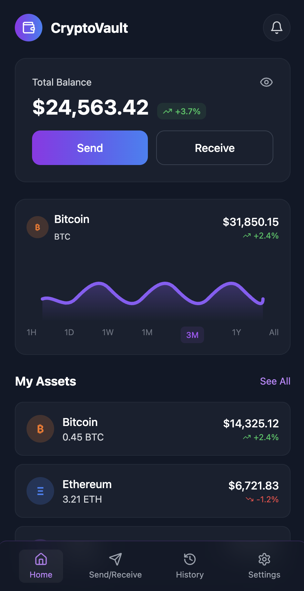
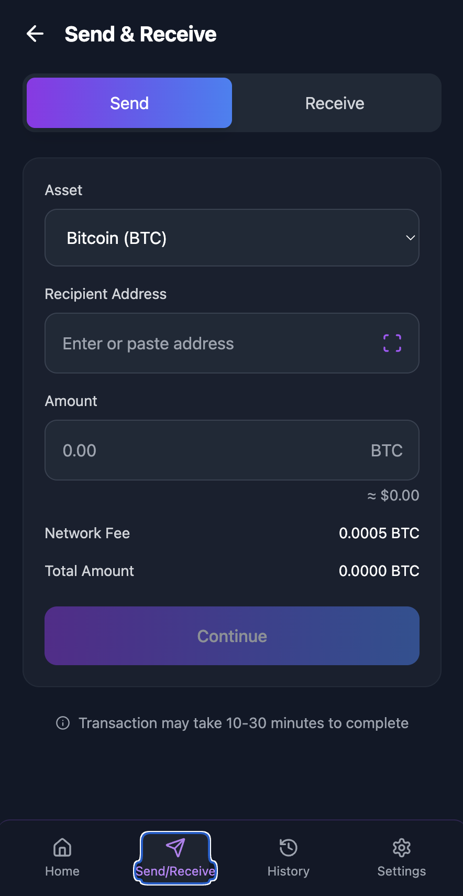
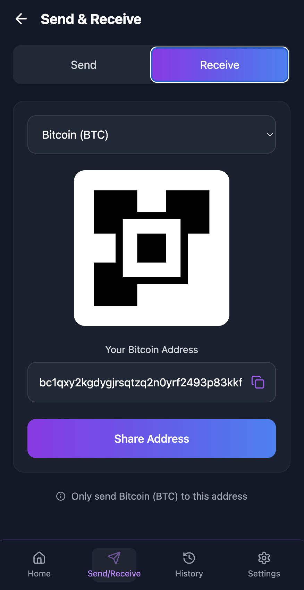
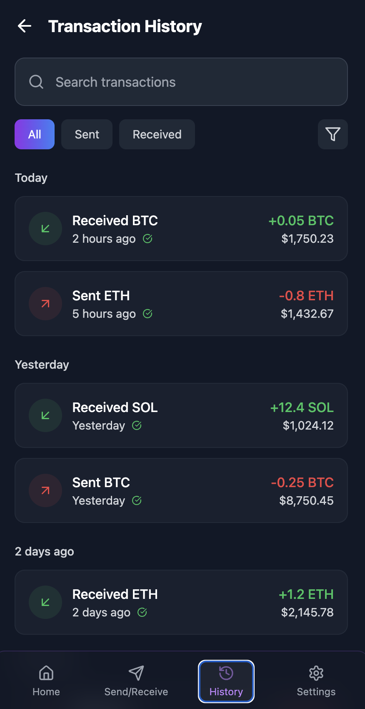

# 🔐 CryptoVault Mobile UI

A modern, secure, and user-friendly cryptocurrency wallet mobile interface built with React and TypeScript. CryptoVault provides a seamless experience for managing digital assets with bank-grade security and an intuitive design.

<div align="center">




</div>

## ✨ Features

### 🔒 Security First
- **Bank-grade encryption** for ultimate security
- **Biometric authentication** support
- **Secure seed phrase backup** system
- **Auto-lock functionality** for enhanced protection

### 💼 Wallet Management
- **Multi-asset support** (Bitcoin, Ethereum, Solana, and more)
- **Real-time portfolio tracking** with live price updates
- **Balance visibility toggle** for privacy
- **Interactive price charts** for market analysis

### 💸 Send & Receive
- **QR code generation** for easy receiving
- **Address scanning** for quick sending
- **Network fee calculation** and optimization
- **Transaction confirmation** with detailed summaries

### 📊 Transaction History
- **Comprehensive transaction list** with filtering options
- **Search functionality** to find specific transactions
- **Status tracking** (completed, pending, failed)
- **Detailed transaction information** with timestamps

### 🎨 User Experience
- **Dark/Light theme** support
- **Responsive mobile design** optimized for all screen sizes
- **Smooth animations** and transitions
- **Intuitive navigation** with bottom tab bar

## 📱 Screenshots

<div align="center">






</div>

CryptoVault Mobile UI showcases a complete cryptocurrency wallet experience with modern design and intuitive functionality. The application features a beautiful onboarding flow, comprehensive dashboard with portfolio tracking, seamless send/receive operations with QR code support, detailed transaction history with filtering capabilities, and robust security settings including biometric authentication and backup options.

## 🛠️ Technology Stack

- **Frontend Framework:** React 18.3.1
- **Language:** TypeScript 5.5.4
- **Build Tool:** Vite 5.2.0
- **Styling:** Tailwind CSS 3.4.17
- **Icons:** Lucide React 0.441.0
- **Routing:** React Router DOM 6.26.2
- **Development:** ESLint, PostCSS, Autoprefixer

## 🚀 Getting Started

### Prerequisites

- Node.js (version 16 or higher)
- npm or yarn package manager

### Installation

1. **Clone the repository**
   ```bash
   git clone https://github.com/yourusername/cryptovault-mobile-ui.git
   cd cryptovault-mobile-ui
   ```

2. **Install dependencies**
   ```bash
   npm install
   ```

3. **Start the development server**
   ```bash
   npm run dev
   ```

4. **Open your browser**
   Navigate to `http://localhost:5173` to view the application.

### Available Scripts

- `npm run dev` - Start development server
- `npm run build` - Build for production
- `npm run preview` - Preview production build
- `npm run lint` - Run ESLint for code quality

## 📁 Project Structure

```
src/
├── components/          # Reusable UI components
│   ├── CryptoAsset.tsx     # Asset display component
│   ├── Navigation.tsx      # Bottom navigation bar
│   ├── PriceChart.tsx      # Interactive price chart
│   └── TransactionItem.tsx # Transaction list item
├── context/             # React context providers
│   └── ThemeContext.tsx    # Theme management
├── pages/               # Application screens
│   ├── Dashboard.tsx       # Main portfolio view
│   ├── SendReceive.tsx     # Send/receive interface
│   ├── Settings.tsx        # Settings panel
│   ├── Transactions.tsx    # Transaction history
│   └── Welcome.tsx         # Onboarding flow
├── App.tsx              # Main application component
├── AppRouter.tsx        # Application routing
├── index.css            # Global styles
└── index.tsx            # Application entry point
```

## 🎯 Key Components

### Dashboard
- Portfolio overview with total balance
- Asset management with real-time prices
- Recent transaction summary
- Quick send/receive actions

### Send & Receive
- Multi-asset support
- QR code scanning and generation
- Network fee estimation
- Address validation

### Transaction History
- Comprehensive transaction list
- Advanced filtering options
- Search functionality
- Status indicators

### Security Features
- Biometric authentication toggle
- Seed phrase backup management
- Auto-lock configuration
- Security settings panel

## 🎨 Design System

### Color Palette
- **Primary:** Purple to Blue gradient (`from-purple-600 to-blue-500`)
- **Dark Mode:** Gray-900 to Black gradient
- **Light Mode:** Gray-50 background
- **Accent Colors:** Green (positive), Red (negative), Yellow (pending)

### Typography
- **Headers:** Bold, clear hierarchy
- **Body Text:** Readable font sizes with proper contrast
- **Monospace:** For addresses and transaction IDs

### Components
- **Cards:** Rounded corners with subtle shadows
- **Buttons:** Gradient backgrounds with hover states
- **Icons:** Lucide React icon library
- **Charts:** Interactive price visualization

## 🔧 Customization

### Adding New Cryptocurrencies
1. Update the mock data in `Dashboard.tsx`
2. Add new asset icons or use existing ones
3. Configure network-specific settings

### Theme Customization
1. Modify colors in `tailwind.config.js`
2. Update theme context in `ThemeContext.tsx`
3. Adjust component styling as needed

### Adding New Features
1. Create new components in `src/components/`
2. Add new pages in `src/pages/`
3. Update navigation in `Navigation.tsx`
4. Configure routing in `App.tsx`

## 🚧 Development Status

This is a **UI prototype** designed to showcase a modern cryptocurrency wallet interface. The application currently uses mock data and does not connect to real blockchain networks or handle actual cryptocurrency transactions.

### Current Features ✅
- Complete UI/UX implementation
- Theme switching (Dark/Light)
- Responsive mobile design
- Interactive components
- Navigation system

### Future Enhancements 🔄
- Real blockchain integration
- Live price data feeds
- Actual transaction processing
- Multi-language support
- Push notifications
- Advanced security features

## 🤝 Contributing

We welcome contributions to improve CryptoVault! Please follow these steps:

1. Fork the repository
2. Create a feature branch (`git checkout -b feature/amazing-feature`)
3. Commit your changes (`git commit -m 'Add amazing feature'`)
4. Push to the branch (`git push origin feature/amazing-feature`)
5. Open a Pull Request

### Development Guidelines
- Follow TypeScript best practices
- Maintain consistent code formatting
- Add proper type definitions
- Test on multiple screen sizes
- Follow the existing component structure

## 📄 License

This project is licensed under the MIT License - see the [LICENSE](LICENSE) file for details.

## 🙏 Acknowledgments

- **Initial UI Generation:** [Magic Patterns](https://www.magicpatterns.com/) - Initial UI generated using MagicPatterns, further developed and customized by Mutlu Kurt
- **Design Inspiration:** Modern fintech applications
- **Icons:** [Lucide React](https://lucide.dev/) for beautiful, consistent icons
- **UI Framework:** [Tailwind CSS](https://tailwindcss.com/) for rapid styling
- **Built with:** Modern React development practices and clean architecture

## 📞 Support

If you have any questions or need support, please:

1. Check the [Issues](https://github.com/yourusername/cryptovault-mobile-ui/issues) page
2. Create a new issue if your question isn't already addressed
3. Contact the development team

---

**⚠️ Security Notice:** This is a UI prototype for demonstration purposes. Never use this application with real private keys or cryptocurrency. Always use properly audited and tested software for actual cryptocurrency transactions.

**Made with ❤️ for the crypto community**